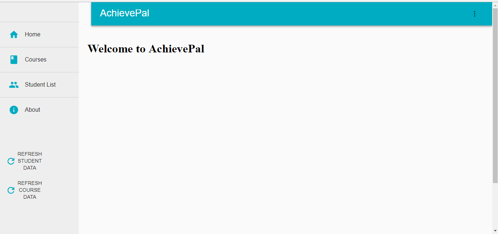

= AchievePal
ifdef::env-github,env-browser[:relfileprefix: docs/]

* This is a analytics Web application designed for university student and insturctors to better manage the class.

== Site Map

* https://bt3103-hosting.firebaseapp.com/[AchievePal]
* https://www.youtube.com/watch?v=XtL9fTfEJOg&feature=youtu.be[Video]
* https://docs.google.com/presentation/d/1_9VPMkguoVJD40LLp2SZ8dIpH48v9kPJ-EWtLPM6Rzk/edit?usp=sharing/[Slides]
* <<UserGuide#, User Guide>>
* <<dummy#, Development Roadmap>>
* https://project-c2ef0.firebaseapp.com/[Deployed Application]

== Acknowledgements

* Some parts of this project used the excellent Material-Ui, Victory and Recharts library
