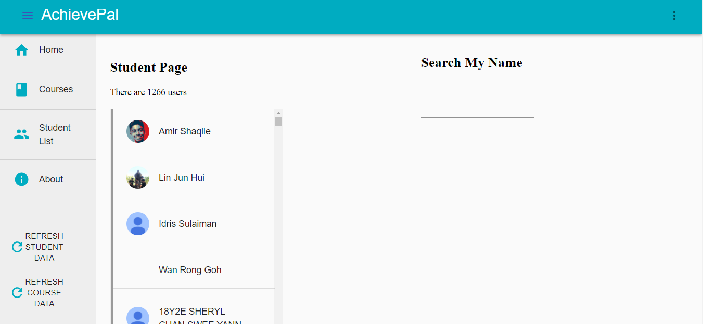
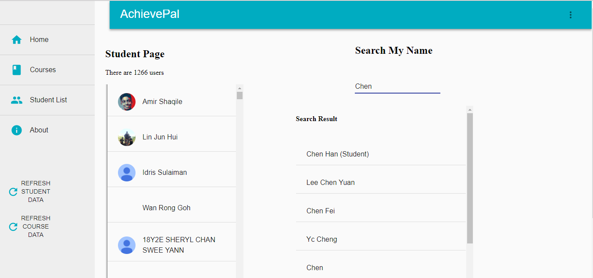

= AchievePal - User Guide
:toc:
:toc-title:
:toc-placement: preamble
:sectnums:
:imagesDir: images
:stylesDir: stylesheets
:xrefstyle: full
:experimental:
ifdef::env-github[]
:tip-caption: :bulb:
:note-caption: :information_source:
endif::[]
:repoURL: https://github.com/CS2103JAN2018-T15-B1/main

By: `Team 5`      From `Jan 2018` to `Apr 2018`

== Introduction

Achievepal is a web app made for *students* and *instructors* to better manage the courseworks. The visualisation of analytics is derived from the achievement app data. 

== Start

.  You can directly click https://bt3103-hosting.firebaseapp.com/[AchievePal] to start the journey!
.  Refer to <<Features>> for more details of our features.

[[Features]]
== Steps to play with our application! 

=== Access student List

.  Click the `Student List` tab from the left side bar. 

=== Select the particular student 

.  Click the student name and go to the student profile

=== View the student Profile
image::studentProfile.png[width="600"]

.  The student profile contains mainly three components, which are student's particulars & submitted assignments, student's Capacity map as well as student's position in terms of codecombat level wwith in his/her class.

=== Access course List
course list contains all the courses registered in the Achievement App. 

image::courseList.PNG[width="600"]

=== Select particular course 

Users can be redirected to course's profile page by click the course name. 

image::searchCourseName.png[width="600"]

=== View course Profile

image::courseProfile.png[width="600"]

.  The courseProfile contains four components. 
.  The Number of submitted assignments vs Time usage charts plots how many assignment has a student submitted (X-axis) and 
the average time used by the student to finish one assignment.

[NOTE]
The time used for each assignment is calculated by the time span from the assignment is released until the student submit the assignment.
.  The other two list contains:...

=== Use chat box to discuss with other students within the same class.

=== Refresh the data 

Example:

* `addproduct n/Egg pr/$1 c/Food`

=== Adding an order: `addorder`
Adds an order to Retail Analytics app. +
Format: `addorder e/EMAIL o/SUBORDER [o/MORE_SUBORDERS]...` where `SUBORDER` consists of `PRODUCT_ID QUANTITY COST`.

[NOTE]
The number listed beside the order entry in the GUI is not the displayed index, but the unique id permanently associated with given order. Prices are manually recorded to
allow for discounts and free items.

[TIP]
An order must have at least one suborder. Prices are recorded separately to prevent retroactive sales figure changes when product prices are modified after an order has been made.

Examples:

* `addorder e/alex@example.com o/1 2 $3` adds an order where alex bought 2 pieces of product whose id is 1 for $3 each.
* `addorder e/bernice@example.com o/1 1 $1 o/2 1 $1` adds an order where alex bought 1 of product 1 for $1 and 1 of product 2 for $1, making $2 total.

=== Locating persons by name: `find`

Finds persons whose names contain any of the given keywords. Updates the order view to only show the order made by the persons found.+
Format: `find KEYWORD [MORE_KEYWORDS]...`

****
* The search is case insensitive. e.g `hans` will match `Hans`
* The order of the keywords does not matter. e.g. `Hans Bo` will match `Bo Hans`
* Only the name is searched.
* Only full words will be matched e.g. `Han` will not match `Hans`
* Persons matching at least one keyword will be returned (i.e. `OR` search). e.g. `Hans Bo` will return `Hans Gruber`, `Bo Yang`
****

Examples:

* `find John` +
Returns `john` and `John Doe`
* `find Betsy Tim John` +
Returns any person having names `Betsy`, `Tim`, or `John`

// tag::findproducts[]
=== Locating products by name: `findproductbyname`

Finds products whose names contain any of the given keywords.
Format: `findproductbyname KEYWORD [MORE_KEYWORDS]...`

[NOTE]
Like `find`, the search is case insensitive and the keyword order does not matter. Only the name is searched and perfect keyword matches will be returned.

=== Finding all products within a certain price range: `findproductbyprice`
Filters out all the products within the range [`MIN_PRICE`, `MAX_PRICE`] and displays them in the GUI.

*Format*: `findproductbyprice minpr/MIN_PRICE maxpr/MAX_PRICE`

*Example*:

* `findproductbyprice minpr/10 maxpr/200` finds products with price between 10 and 200, inclusive

[IMPORTANT]
The model makes predictions only considering the persons' _age_ and _gender_. To cap the influence of high volume buyers, multiple purchases of the same product are ignored. +

An analogous use would be how companies like Amazon know which products to recommend you in their targeted emails. Now, you can do the same for your business too. +

*For v2.0*: Support for consideration of predictive factors other than age and gender, and the option to not recommend products a user has already bought.

*Format*: `recommend INDEX`

[TIP]
The sample data provided includes an order history of mostly younger persons buying `TrendyShirt`, older persons buying `Dentures`, females buying `Lipstick`, and a general audience for `Toothbrush`. You can casually validate the algorithm by noticing that the recommendations for a younger person ranks `TrendyShirt` at the front of the output, while `Dentures` will be right at the rear. Experiment by adding different persons, products, and orders, and see how he recommendations respond!

