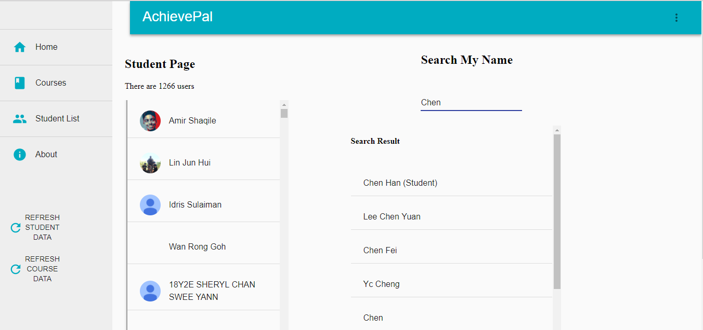
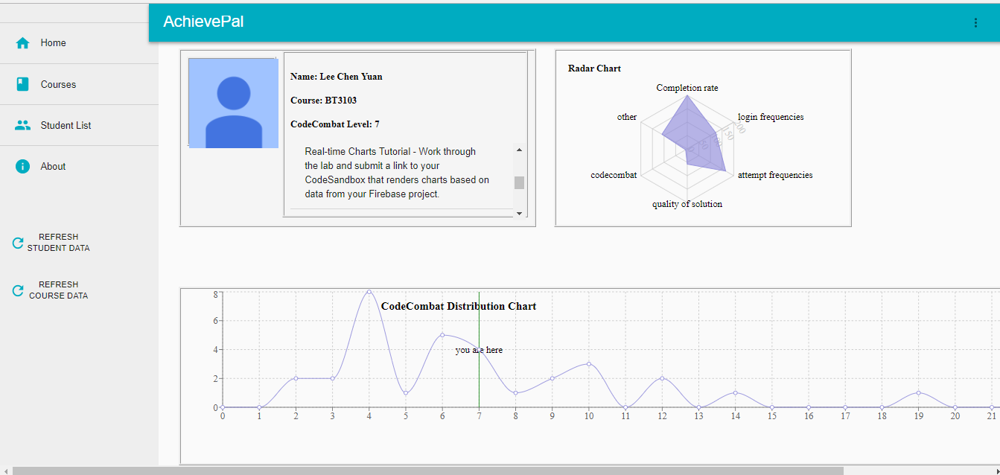
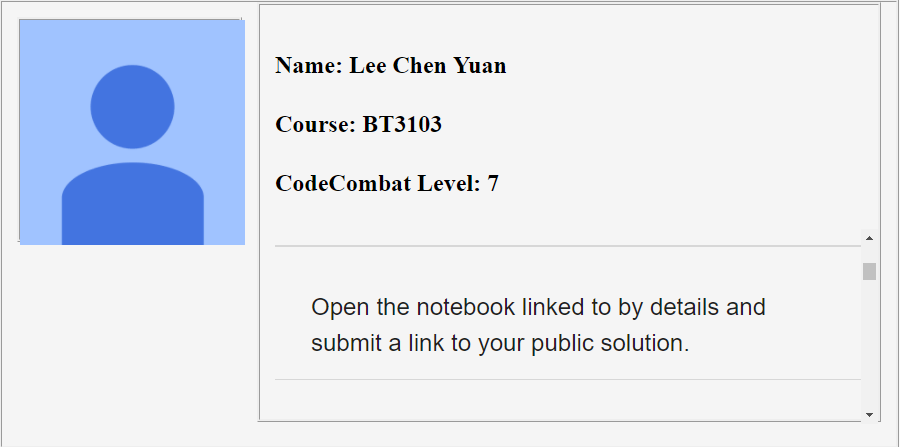
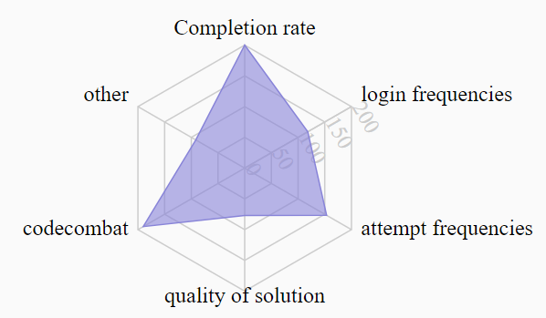
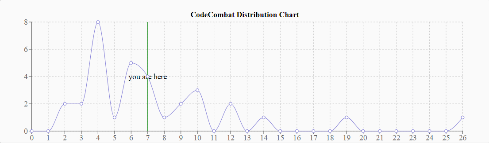
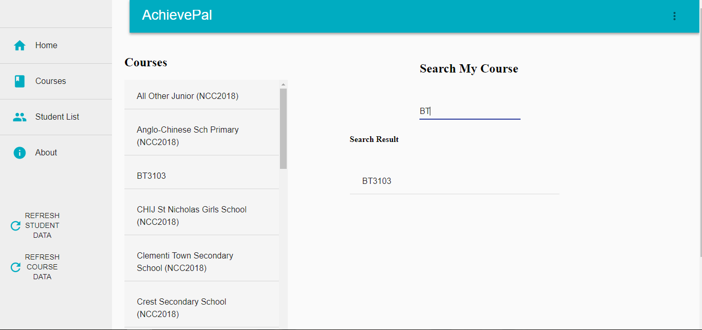
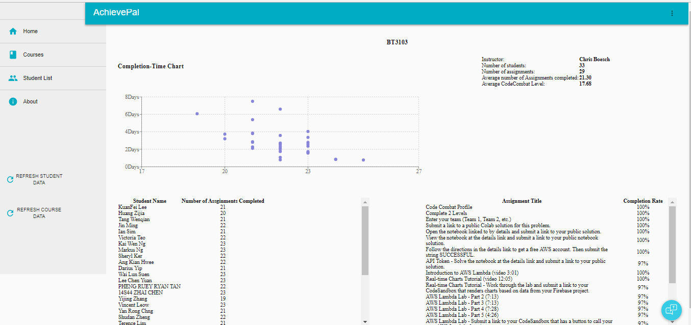
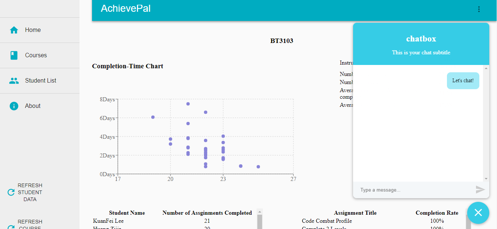

= AchievePal - User Guide
:toc:
:toc-title:
:toc-placement: preamble
:sectnums:
:xrefstyle: full
:experimental:
ifdef::env-github[]
:tip-caption: :bulb:
:note-caption: :information_source:
endif::[]
:repoURL: https://github.com/BT3103-Team5/AchievePal

== Introduction

Achievepal is a web app made for *students* and *instructors* to better manage the courseworks. It contains information about the assignments as well as visualization about his/her own performance in a certain course to keep students updated and get a direct picture about where should they improve on. On the instructor mode, AchievePal provides visulization about the performance of the overall class and help teachers manage all the students closely. 

== Features

* click https://bt3103-hosting.firebaseapp.com/[AchievePal] to start the AchievePal journey.

=== Student Feature
==== Access student List

Click the `Student List` tab from the left side bar to direct to student list. 

* All the students registered in Achievement App will be displayed in one list. Each row of the list contains students' photo as well as student name. 
* Users can search the particular student that he/she is interested to view. By typing in the student name in the input field on the right side of the screen, the auto complete algorithm will find the name matches the most to the input name and list them down below the input field. Users can click on the one they intend to search for and go to the student Profile page. 

==== View the student Profile

The student profile contains three main components, which are student's particulars & submitted assignments, student's Capacity map as well as student's position in terms of codecombat level wwith in his/her class.

say something

* `Completion rate` is calculated based on the rate of submitting assignment of each student. 
* `CodeCombat` represents the level that student has achieved in codecombat flatform
* `Login frequencies` describes how often student has opened the Achievement App
* `attempt frequencies` describes how often the student has opened any assignment in his/her course. 
* `quality of solution` represents the quality of students solutions. E.g. are the solutions all well phrased and directed to the knowledge that covered in class. (has yet to be implemented) 
* `other` means other aspects of judgement. (has yet to be implemented)  

Below the Capacity map and student's details contains the CodeCombat distribution. Students can gain an understanding of the overall performance of the class interms of codecombat and where they stand among their peers.    

=== Instructor Feature
==== Access course List

Click the `Course` tab from the left side bar to direct to course list. 

* All the courses registered in Achievement App will be displayed in one list. 
* Users can search the particular course that he/she is interested to view. By typing in the course name in the input field on the right side of the screen, the auto complete algorithm will find the name matches the most to the input name and list them down below the input field. Users can click on the one they intend to search for and go to the course Profile page. 

==== View course Profile

* The courseProfile contains four components, which is Number of submitted assignments vs Time usage scatter chart, course's details, registered student list as well as released assignment list. 
* The Number of submitted assignments vs Time usage charts plots how many assignment has a student submitted (X-axis) versus 
the average time used by the student to finish one assignment (Y-axis). The spedific figure about each student will appear when user hovers around each dot. 
* Student List contains all the student names as well as number of assignments finished by each of them. 
* Assignment List contains all the assignment together with the submission rate for each of them. 
[NOTE]
The time used to finish each assignment is calculated by the difference of time between when the assignment is released and when the student submits the solution.

==== Use chat box to discuss with other students within the same class.

* The chat room is the place where everyone in the class can share their opinion and discuss about relevant topics.
* Both students and instructors can use the chat box to interact with anyone else in the same class.

==== Refresh the data 
By click the button on the side bar, latest live data from the Achievement API will be loaded in a few seconds. The visualization and other information will change automatically without reloading the whole page.
